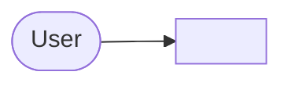
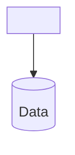
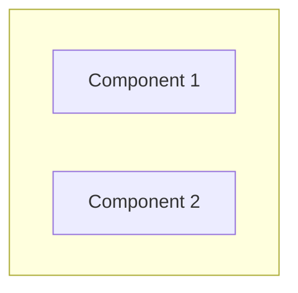
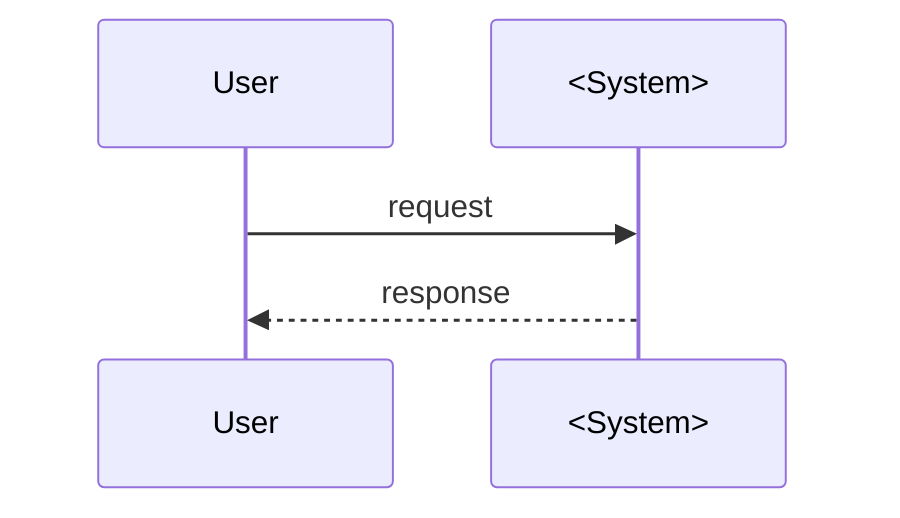
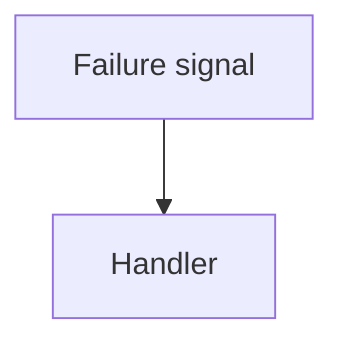
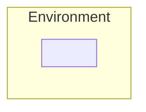
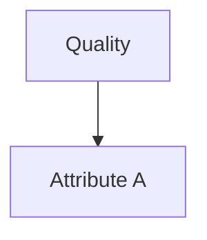

# <System> — Architecture (arc42)

arc42 skeleton, 12 sections. Related: [ADR log](adr/), [behavioral contracts](behaviors/), [precise contracts](contracts/), [traceability](traceability.md).

---

## 1. Introduction & Goals

### 1.1 Requirements overview

<!-- 2-4 sentences: what the system is and does. -->

### 1.2 Quality goals (top 5)

<!-- Ranked; each goal has a measurable, Gherkin-style scenario and links to its ADR. -->

| # | Goal | Scenario (Gherkin-style) | Linked |
|---|---|---|---|
| Q1 | | | |
| Q2 | | | |
| Q3 | | | |
| Q4 | | | |
| Q5 | | | |

### 1.3 Stakeholders

| Stakeholder | Expectations |
|---|---|
| | |

## 2. Constraints

| Constraint | Source |
|---|---|
| | |

## 3. Context & Scope

### 3.1 System context (C4 L1)

### 3.2 External interfaces

| Interface | Protocol | Notes |
|---|---|---|
| | | |

## 4. Solution Strategy

<!-- The architecture's defining moves — the 2-5 decisions that shape everything else. -->

## 5. Building Block View

### 5.1 Container view (C4 L2)

### 5.2 Component view (C4 L3)

| Component | Responsibility | Detail |
|---|---|---|
| | | |

### 5.3 Code level (C4 L4)

<!-- Deferred — generated from source as it lands. Name the pre-defined seams/interfaces. -->

## 6. Runtime View

### 6.1 Happy path

### 6.2 Failure / degradation path

## 7. Deployment View

## 8. Cross-cutting Concepts

| Concept | Approach |
|---|---|
| | |

<!-- Precise, normative specs for cross-cutting mechanisms live in contracts/. -->

## 9. Architectural Decisions

Full records in [adr/](adr/). Index:

| # | Decision | Status |
|---|---|---|
| | | |

## 10. Quality Requirements

### 10.1 Quality tree

### 10.2 Quality scenarios

| # | Scenario |
|---|---|
| | |

### 10.2b Functional behavior contracts

| Feature file | Concern | Source ADRs |
|---|---|---|
| | | |

### 10.3 Definition of done (documentation)

The documentation set is complete when:

- No `TBD` / placeholder text remains anywhere.
- Every ADR appears in the §9 index.
- Every §10.2 quality scenario links a Gherkin behavior contract (see traceability.md).
- Cross-cutting mechanisms have a precise contract in `contracts/` and are linked from §8.
- ADR decisions are traceable to arc42 sections, behaviors, and contracts (traceability.md).

## 11. Risks & Technical Debt

| # | Risk | Severity | Mitigation |
|---|---|---|---|
| | | | |

## 12. Glossary

| Term | Definition |
|---|---|
| | |

---

## Appendix A: Standards mapping (ISO/IEC/IEEE 42010 + SEI Views & Beyond)

| 42010 concept | Where |
|---|---|
| Concerns | §1.2 quality goals, §10.1 tree |
| Viewpoints | Appendix B (declared below) |
| Views | §5 (structure), §6 (runtime), §7 (deployment) |
| Architecture decisions | §9 + ADR log |
| Rationale | ADR Context/Consequences sections |
| Correspondences | Appendix B mapping table |

| SEI viewtype | Style | This system |
|---|---|---|
| **Module** | layered, decomposition | §5.2 components; packages; hierarchy |
| **Component-and-connector** | communicating-processes, shared-data | §6: runtime elements + connectors |
| **Allocation** | deployment | §7: environment/hardware mapping |

## Appendix B: Viewpoint declaration

| Viewpoint | Audience | Concern | Section |
|---|---|---|---|
| Context | everyone | scope, interfaces | §3 |
| Container | architects | technology choices, boundaries | §5.1 |
| Component | developers | responsibilities, seams | §5.2 |
| Runtime | developers/ops | behavior, failure, degradation | §6 |
| Deployment | platform engineers | environment, constraints | §7 |
| Decision | all future maintainers | why | §9, ADR log |
| Behavior contracts | testers/agents | executable rules | behaviors/ |
