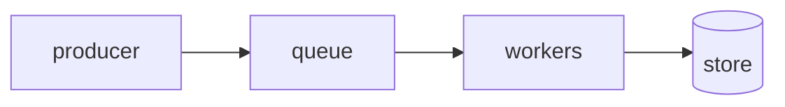

# Concurrency topology contract

The bounded graph: which queue feeds what, capacities, backpressure, and
single-writer serialization. Source ADRs: (list).

## 1. The graph

Every queue is bounded. Producers block when a queue is full — backpressure,
never unbounded buffering.

## 2. Queues and capacities

| Queue | Feeds | Capacity |
|---|---|---|
| | | |

## 3. Backpressure behavior

- <what blocks, what continues, what happens on pressure>

## 4. Single-writer serialization

- <which stores are single-writer, and how reads/writes interleave>

## 5. Invariants

- <no unbounded buffer; at most one of X in flight; backpressure propagates to the source>
