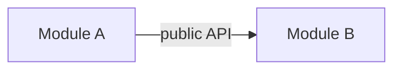

# Module boundaries contract

The per-system record of every module, its public API, and the dependency
graph. Normative per the base model (`base-model.md`) — sealed-by-default
modules exposing only defined public APIs. Source ADRs: ADR-0001 (base model),
and the module-specific ADRs that define each boundary.

## 1. Modules

| Module | Owns (concern) | Public API (defined operations) | Hidden internals |
|---|---|---|---|
| | | | |

Anything **not** listed in "Public API" is private and unreachable from other
modules.

## 2. Dependency graph

- Every edge targets a module's **public API**, never its internals.
- The graph is **acyclic**; direction is inward.
- Leaf modules (no out-edges) hold pure/deterministic logic.

## 3. Public API signatures

Each public API is specified precisely in `contracts/interface.md` (one per
module) or inline below:

<!-- For each module: operation names, parameter/return shapes, error surface. -->

## 4. Invariants

- No cross-module dependency reaches outside a defined public API (base model R1–R3).
- The dependency graph is acyclic (R4).
- Each public API is narrow and stable (R2) and contracted (R6).
